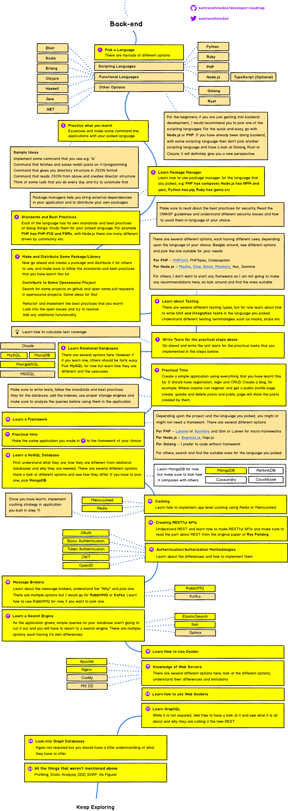

# Arquiteto de Solução

Para atender esse objetivo, precisamos conhecer os diversos componentes presentes na empresa, seus motivadores de negócio de médio e longo prazo, seus relacionamentos externos, suas políticas e departamentos, a cultura organizacional, seus colaboradores, seus riscos e forças de mercado, além do mapa de influenciadores e tomadores de decisão que suportam os diversos projetos internos da empresa.

Um arquiteto de solução atua primariamente na construção de soluções baseadas nas necessidades do negócio, fazendo uso dos serviços e recursos tecnológicos já existentes na empresa. Outro objetivo é o de alinhar novas soluções aos princípios arquiteturais já definidos, respeitando os padrões e integrações da empresa.

Têm a responsabilidade de reutilizar funcionalidades e serviços, devem alinhar novas soluções aos princípios arquiteturais já definidos respeitando os padrões e integrações existentes. Devem buscar o balanceamento entre os requisitos funcionais e não funcionais com a priorização e compromissos necessários à empresa em que atuam.

> Um arquiteto de solução precisa alcançar o sucesso dos projetos o qual está envolvido e ao mesmo tempo, procurar alinhar as expectativas da unidade de negócio responsável pelo projeto com os princípios arquiteturais e a reutilização das capacidades tecnológicas da empresa.

### Habilidades técnicas e não técnicas que devem ser destacadas

O arquiteto de solução é predominantemente focado na modelagem de componentes e na interação destes componentes, como se estivesse formando um grande castelo com peças de lego, ele é capaz de sugerir a solução de um problema por meio de sistemas e subsistemas que consideram os princípios de modelagem de software mais utilizados como isolamento, camadas, separação de conceitos entre outros.

A modelagem por meio de componentes não necessariamente cobre a construção de componentes funcionais, quaisquer dependências subjacentes sobre o modelo operacional lógico e componentes operacionais ou de requisitos não funcionais devem, idealmente, ser também descritos como parte da solução. Esta é uma visão holística de todo o problema levando em conta todas as dimensões com o objetivo de fornecer a estrutura e o entendimento necessário para que a solução seja efetivamente construída.

Ser um arquiteto de solução requer conhecimento e habilidades que são ao mesmo tempo amplas e profundas. Para que possa ser efetivo, o arquiteto de solução precisa ter experiência tanto em hardware como em software, e estar confortável com ambientes de sistemas heterogêneos e complexos. Além disso, seu conhecimento em redes de dados, incluindo internet, serão necessários quando a solução necessitar comunicar com soluções em cloud ou integrar com parceiros.

# Métodos 

> Organizam processos, definem papéis e permitem uma melhor administração dos componentes de TI de uma empresa. 

* [ITIL](https://github.com/renanbym/solution-architect/blob/master/metodos/itl.md) - Information Technology Infrastructure Library
* [COBIT](https://github.com/renanbym/solution-architect/blob/master/metodos/cobit.md) - Control Objectives for Information and related Technology
* [PRINCE](https://github.com/renanbym/solution-architect/blob/master/metodos/prince.md) - PRojects IN Controlled Environments

# Frameworks

> Oferecem uma estrutura de criação/implementação de uma arquitetura corporativa

* [FEA](https://github.com/renanbym/solution-architect/blob/master/frameworks/fea.md) - Federal Enterprise Architecture
* [DODAF](https://github.com/renanbym/solution-architect/blob/master/frameworks/dodaf.md) - Department of Defense Architecture Framework
* [TOGAF](https://github.com/renanbym/solution-architect/blob/master/frameworks/togaf.md) - The Open Group Architecture Framework

# Ecosytem

