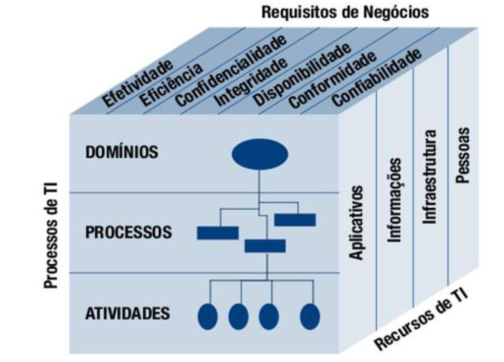

# COBIT - Control Objectives for Information and Related Technologies

> O framework define um conjunto de processos genéricos para o gerenciamento de TI, com cada processo definido em conjunto com entradas e saídas do processo, key process-activities (KPAs), objetivos de processo, medidas de desempenho e um modelo de maturidade elementar.

> O Cobit depende das plataformas adotadas nas empresas, tal como não depende do tipo de negócio e do valor e participação que a tecnologia da informação tem na cadeia produtiva da empresa.

## Orientação

### Framework

> Consiste em vincular metas comerciais a objetivos de TI, fornecendo métricas e modelos de maturidade para medir sua conquista e identificando as responsabilidades associadas dos proprietários de processos comerciais e de TI.

O foco do processo do COBIT é ilustrado por um modelo de processo que subdivide TI em 4 domínios

* Planejar e Organizar
* Adquirir e Implementar
* Entregar e Suportar
* Monitorar e Avaliar

> Harmoniza com outros padrões de TI mais detalhados e boas práticas, tais como COSO, ITIL, BiSL, ISO 27000, CMMI, TOGAF e PMBOK.

### Componentes

* Framework: organiza objetivos de governança de TI e boas práticas por domínios e processos de TI e os conecta a requisitos de negócios;
* Descrição do processo: modelo de processo de referência e linguagem comum para todos na organização. Os processos mapeiam as áreas responsáveis por planejar, construir, executar e monitorar;
* Objetivos de controle: fornece um conjunto completo de requisitos de alto nível a serem considerados pelo gerenciamento para o controle efetivo de cada processo de TI;
* Diretrizes de gerenciamento: ajuda a atribuir responsabilidade, concordar com os objetivos, medir o desempenho e ilustrar a inter-relação com outros processos;
* Modelos de maturidade: avalia a maturidade e a capacidade por processo e ajuda a resolver lacunas.

## O cubo do Cobit

> É o modelo que representa como os componentes se inter-relacionam

### Critérios de Informação/Requisitos de Negócio

* Efetividade: informação relevante e pertinente para o processo de negócio, bem como entregue em tempo, de maneira correta, consistente e utilizável.
* Eficiência: entrega da informação através do melhor uso dos recursos, de forma mais produtiva e econômica.
* Confidencialidade: proteção das informações confidenciais a fim de se evitar sua divulgação indevida.
* Integridade: fidedignidade e totalidade da informação, bem como sua validade para o negócio.
* Disponibilidade: informação acessível e utilizável quando exigida pelo negócio. Também possui relação com a salvaguarda dos recursos necessários e sua capacidade.
* Conformidade: aderência a leis, regulamentos e obrigações contratuais relacionadas ao negócio.
* Confiabilidade: entrega da informação apropriada para tomada de decisão.

### Recursos de TI

* Aplicações: sistemas de informação usados na organização
* Infraestrutura: tecnologia utilizada, como os equipamentos, sistemas operacionais, redes de comunicação de dados que processam as aplicações
* Informações: são os dados em todas as suas formas utilizados nos sistemas de informação e usados pelos processos de negócios
* Pessoas: as pessoas requeridas para planejar, organizar, adquirir, entregar, dar suporte e monitorar os aplicativos, processos e serviços de TI

### Processos de TI

* Domínios
* Processos
* Atividades

## Estrutura do Cobit

Cobit cobre 4 domínios, os quais possuem 34 processos, e estes processos possuem 210 objetivos de controle:

* Planejar e Organizar
* Adquirir e Implementar
* Entregar e Suportar
* Monitorar e Avaliar
   
Cada processo do Cobit deve descrever as seguintes características:

* Nome do processo
* Descrição do processo
    * Critérios de informação
    * Declaração genérica de ações
        * Indicadores de performance
    * Recursos de TI envolvidos
    * Objetivos de controle detalhados
    * Diretrizes de gerenciamento
        * Entradas
        * Saídas
        * Matrizes de responsabilidade
        * Objetivos e métricas
    * Modelo de maturidade

[Wiki](https://pt.wikipedia.org/wiki/COBIT)